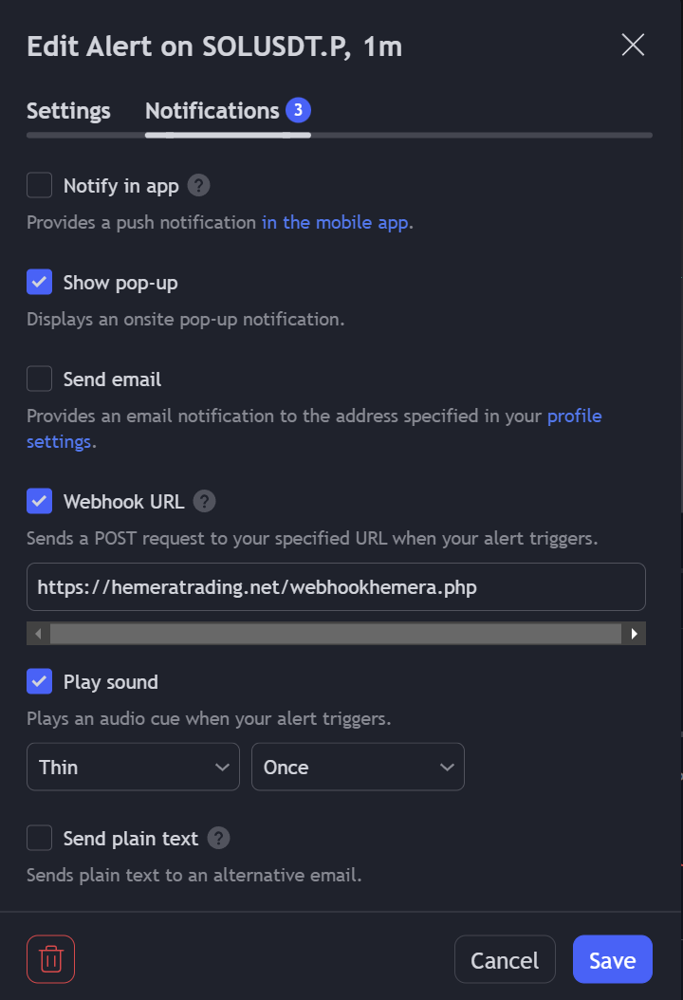
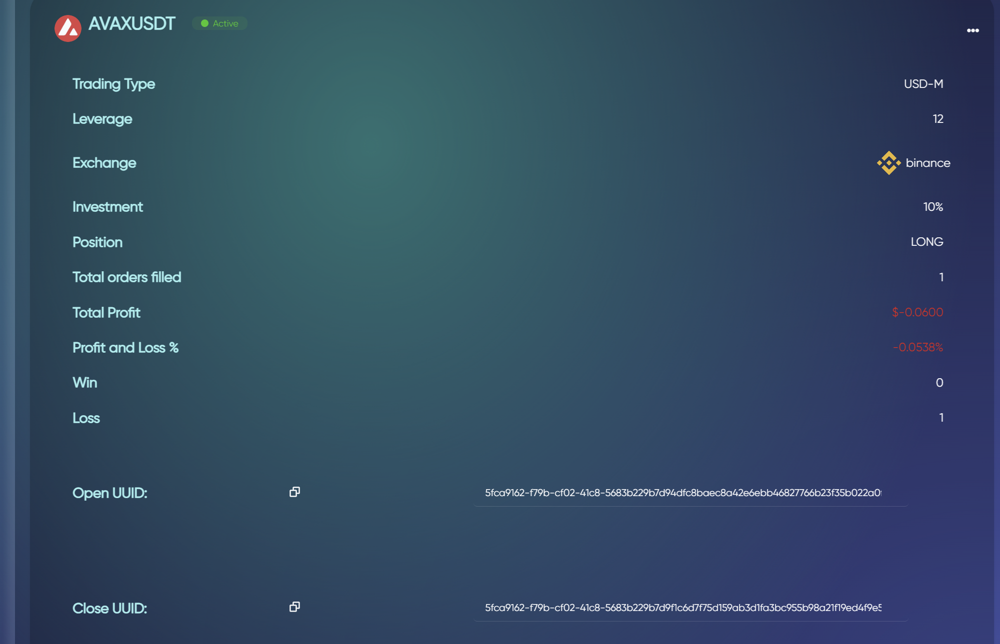
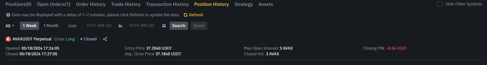
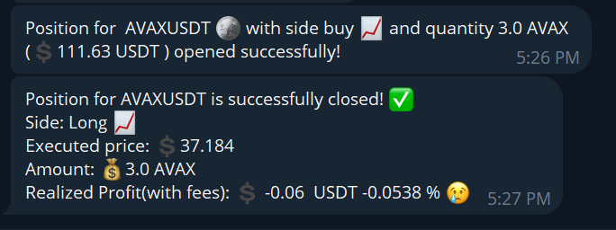

# 💡 How to Automate Your Trades with TradingView Alerts on Formion 📈🔔

Automating your trades on Formion using TradingView alerts is a seamless and powerful way to execute your trading strategies without manual intervention. Follow these steps to set up and start automating your trades efficiently.

#### Step-by-Step Guide

#### 1. Access the TradingView Bot Page on Formion 🌐

Navigate to the TradingView bot page on Formion to set up your bot:

1. **Login** to your Formion account.
2. Go to the **TradingView Bot** section (`twbot.php`).

#### 2. Create a New TradingView Bot 🤖

Click on the **Create TradingView Bot** button to set up a new bot:

1. **Symbol:** Enter the trading pair symbol (e.g., BTCUSDT, LINKUSDT).
2. **Exchange:** Select your preferred exchange (e.g., Binance, Bybit).
3. **Trading Type:**
   * **Choose between `SPOT` and `USD-M`.**
   * **Bybit Users:**
     * `USD-M` refers to Futures trading on the Unified Trading Account (UTA).
     * `SPOT` refers to spot trading on the UTA.
4. **Position:** Select `BUY` for long positions or `SELL` for short positions.
5. **Leverage:** Set your leverage if you choose `USD-M`.
6. **Investment Amount:** Enter the amount you want to invest per trade.

After filling in the details, click on the **Create Bot** button. Formion will automatically generate the necessary UUIDs for opening and closing positions.

#### 3. Configure the Webhook URL on TradingView 🔗

To automate your trades, you'll need to configure alerts on TradingView using Formion's webhook URL.

1. **Open TradingView:**
   * Go to [TradingView](https://www.tradingview.com/).
2. **Set Up Alerts:**
   * Click on the `Alert` icon or right-click on your chart and select `Add Alert`.
   * Choose the condition based on your strategy (e.g., `Crossing`, `Moving Up`).
   * On message field put _<mark style="color:orange;">**`{{strategy.order.alert_message}}`**</mark>_
3. **Webhook URL:**
   * In the alert creation menu, find the `Webhook URL` field.
   * Enter the Formionwebhook URL: `https://formion.ai/webhookformion.php`.

<figure><figcaption>
Make sure Webhook URL is https://hemeratrading.net/webhookhemera.php
</figcaption></figure>

#### 4. Use Generated UUIDs in Alerts 🔑

Each bot has unique UUIDs for opening and closing trades, generated when the bot is created. Follow these steps to use them:

1. **Find UUIDs:**
   * In the `twbot.php` page, locate your newly created bot.
   * Note down the **Open UUID** and **Close UUID** for the bot.
2. **Set Up Alerts on TradingView:**
   *   **Open/Close Long/Short Alerts:**

       * In the alert message, include the Open UUID.
       * Example: `{"Open Long Command": "YOUR_OPEN_UUID"}`.
       * In the alert message, include the Close UUID.
       * Example: `{"Close Long Command": "YOUR_CLOSE_UUID"}`.

       The same is with Short commands ( Both Open Short and Close Short UUID fields are required!)

#### 5. Activate and Test Your Bot ⚙️

1. **Activate Bot:**
   * Ensure your bot is set to `Active` on the `twbot.php` page.
2. **Test Your Alerts:**
   * Trigger alerts on TradingView to test if the bot executes trades as expected.

#### 6. Repeat for Short Positions 📉

To automate short positions, create a separate bot for short trades:

1. **Repeat Steps 2-5:** Create a new bot with `SELL` as the position, and set up corresponding alerts with the new UUIDs for short positions.

#### Emoji Recap 📌

* 🌐 Access the TradingView Bot Page
* 🤖 Create a New TradingView Bot
* 🔗 Configure the Webhook URL on TradingView
* 🔑 Use Generated UUIDs in Alerts
* ⚙️ Activate and Test Your Bot
* 📉 Repeat for Short Positions

By following these steps, you'll be able to automate your trades seamlessly using Formion and TradingView alerts. Happy trading! 🚀\
\
Here is some images how it works.

<figure><figcaption>
Avax Long TradingView Bot
</figcaption></figure> <figure><figcaption>
Executed alert for close order on binance
</figcaption></figure> <figure><figcaption>
Telegram information about trade.
</figcaption></figure>

