# 🔑 How to Start with Formion AI? API Connection?

**It's important to have some USDT balance ( 10$ at least) on your Futures account on Binance ( or UTA on Bybit ) for Formion to be able to check your API keys properly!**

## For Binance:

For [Binance](https://binance.com) go to User icon 👤 and [API Managament](https://www.binance.com/en/my/settings/api-management)

<figure>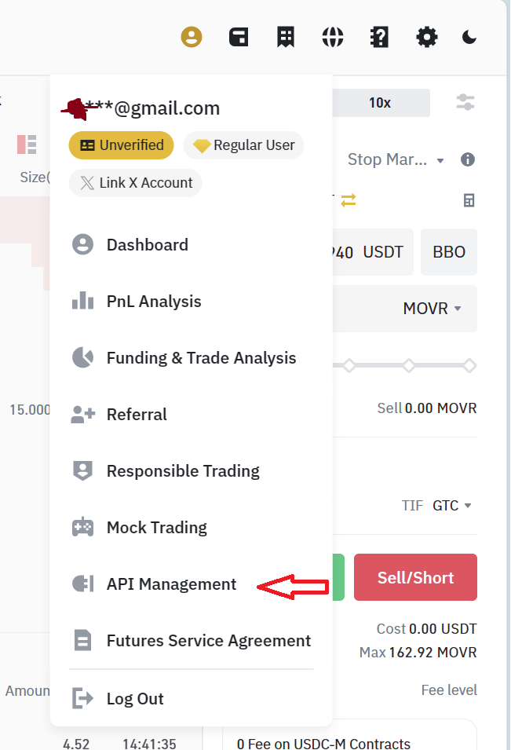<figcaption></figcaption></figure>

Then click on **Create API** button and choose **System generated**, put any name you want and click **Next**

<figure>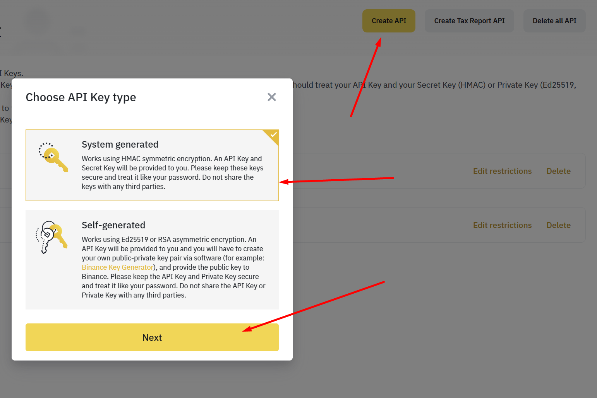<figcaption></figcaption></figure>

You will get **API keys** but you need now to edit it and put a **whitelisted IPs** from Formion settings page and then check **Enable Futures** and **Enable Spot & Margin Trading,** save it and copy both **APY key** and **Secret key** and put into **Settings** page on **Formion**, fill your **password** and click on **Submit.**

<figure>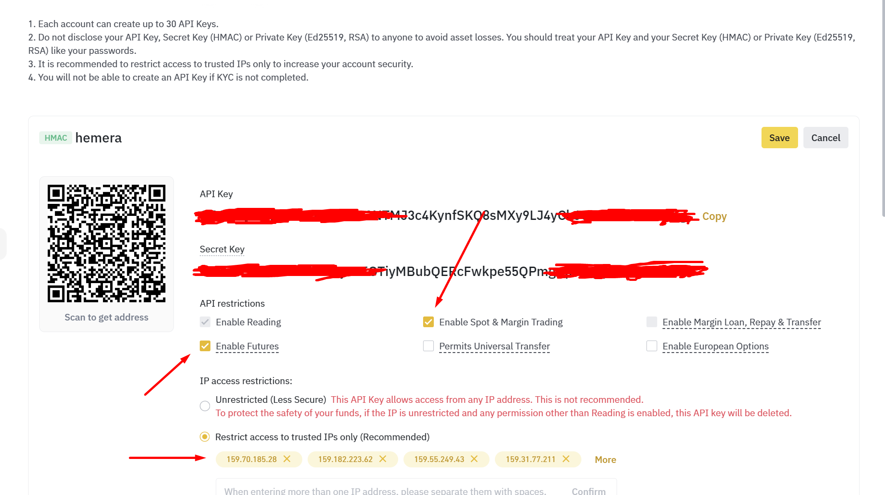<figcaption></figcaption></figure>

Now go to **Formion** [Settings page ](https://hemeratrading.net/user/settings)choose **Binance** as exchange and copy **whitelist IPs:**

<figure><figcaption></figcaption></figure>

<figure><figcaption></figcaption></figure>

**Note: Its important to change mode to HEDGE and Perpetual Margin Mode to CROSS for each USDT pair on Binance Futures!**\\

<figure>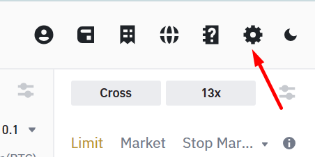<figcaption></figcaption></figure>

<figure>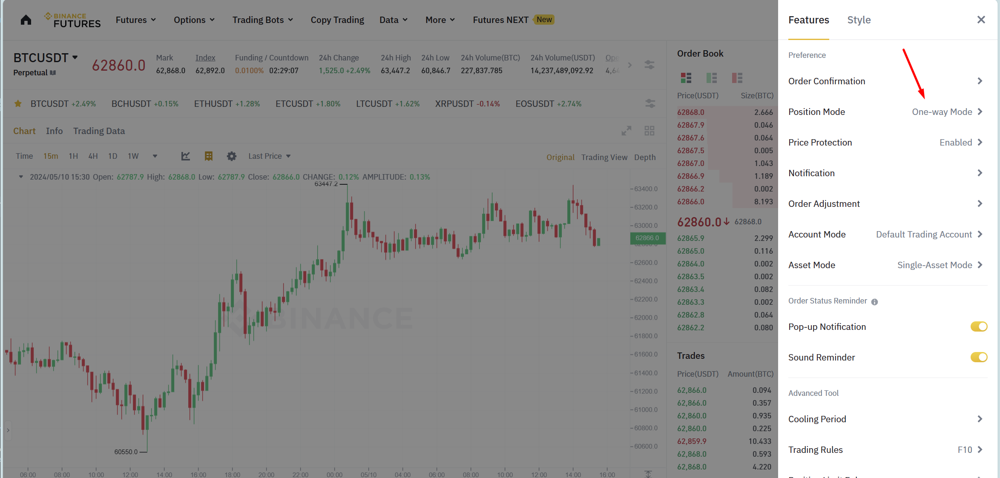<figcaption></figcaption></figure>

<figure>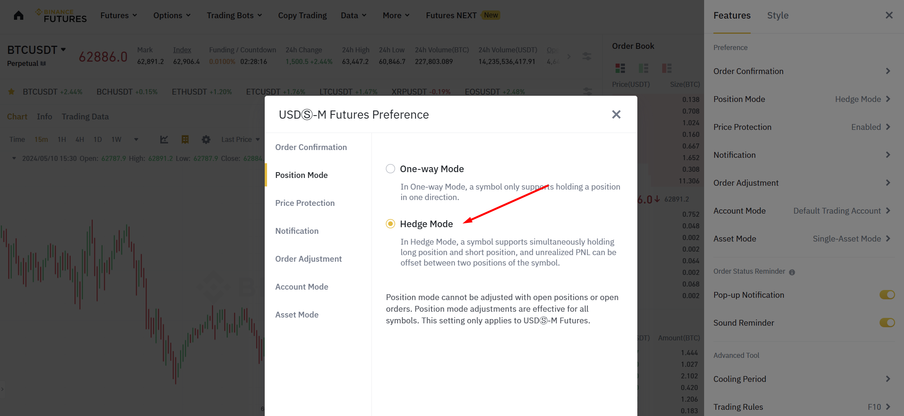<figcaption></figcaption></figure>

<figure>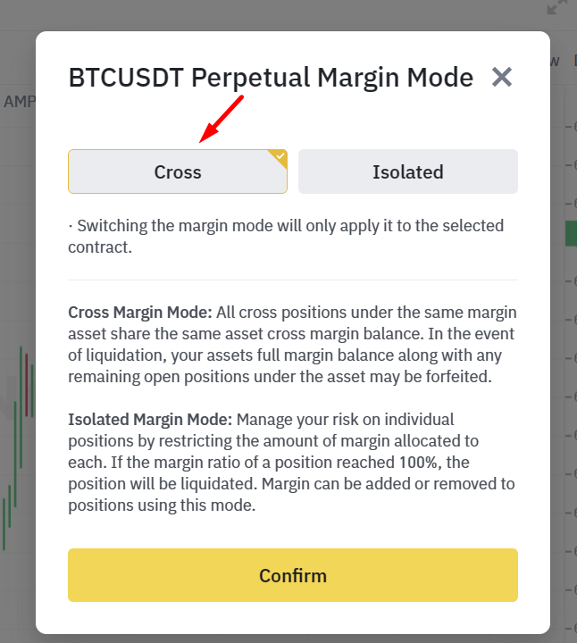<figcaption></figcaption></figure>

## For Bybit:

For Bybit the situation is the same but here if you want to use multiple bots our advice is to create each subaccount for each new bot! Also make sure your account type is UTA ( Unified Trading Account )

<figure>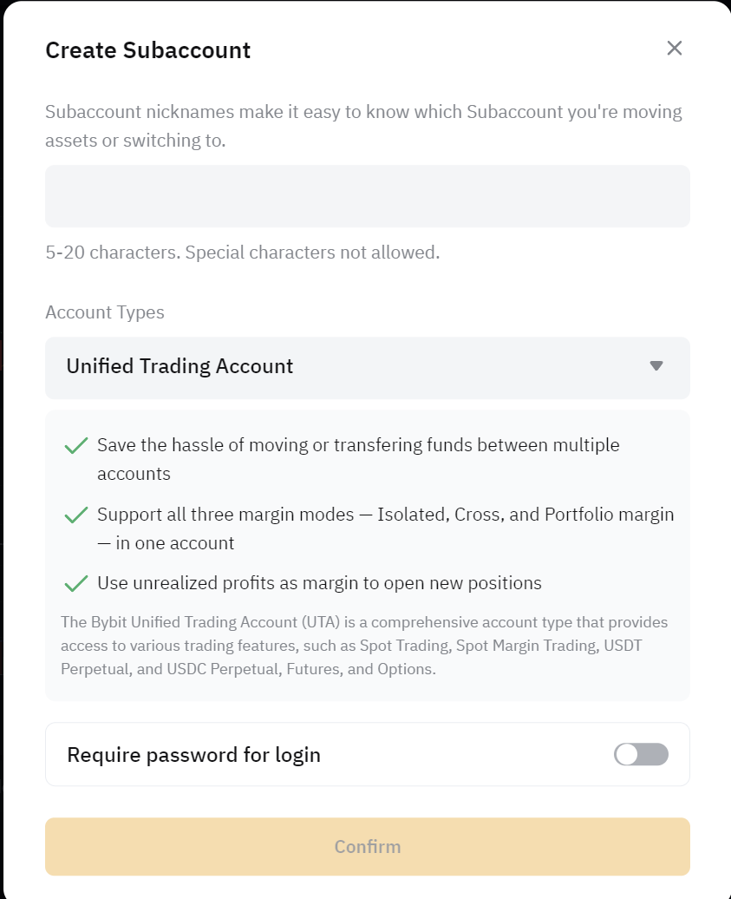<figcaption></figcaption></figure>

Then go to [API ](https://www.bybit.com/app/user/api-management)Managament tab page and click on **Create New Key and enable Google 2FA if you are using it ( It's recommended!)**

<figure>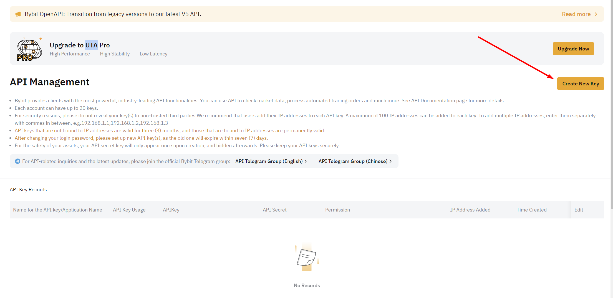<figcaption></figcaption></figure>

Click on System-generated API Keys

<figure>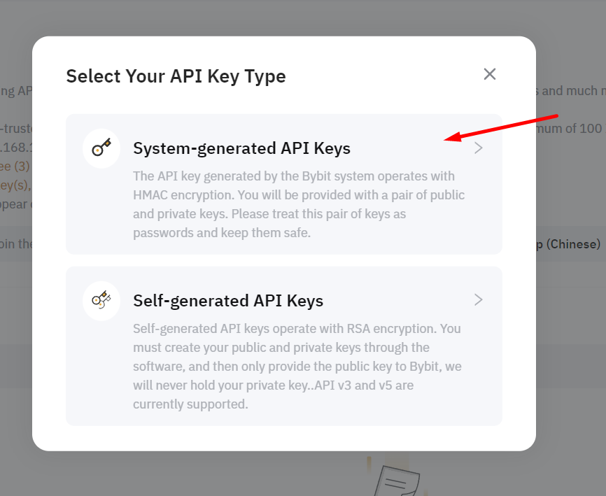<figcaption></figcaption></figure>

Now go to Formion [Settings ](https://formion.ai/user/settings)page and choose Bybit as your exchange, then copy whitelisted IPs

<figure><figcaption></figcaption></figure>

Now here its very important to check Read-Write permission mode and also enable Only IPs mode and your your copied IPs.

<figure>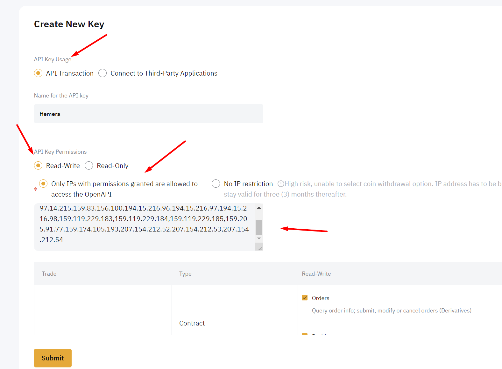<figcaption></figcaption></figure>

Make sure you have checked all those, just Account Transfer and Subaccount Transfer is not required!

<figure>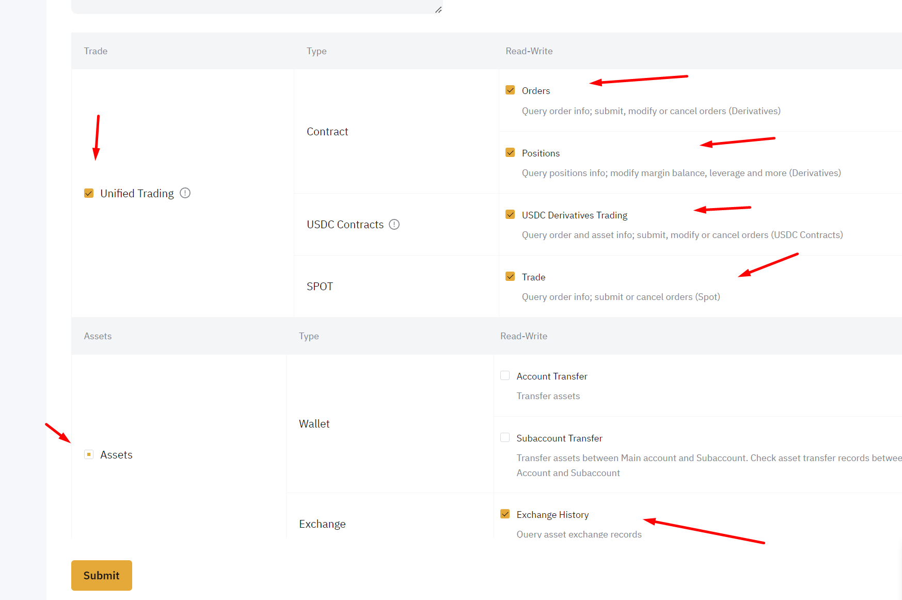<figcaption></figcaption></figure>

Now you will get API key and API Secret and copy both and paste to Formion Settings page, fill with your password and Submit it!

<figure>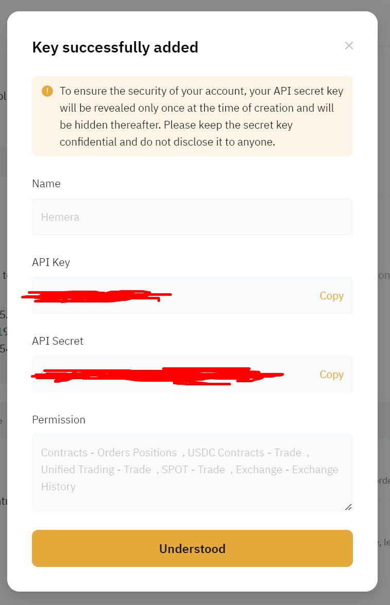<figcaption></figcaption></figure>

\
Also make sure its Hedge Mode and Cross Margin mode enabled for all USDT pairs!\\

<figure>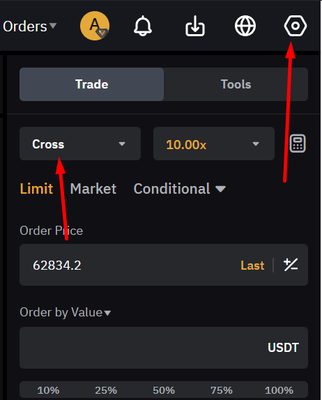<figcaption></figcaption></figure>

<figure>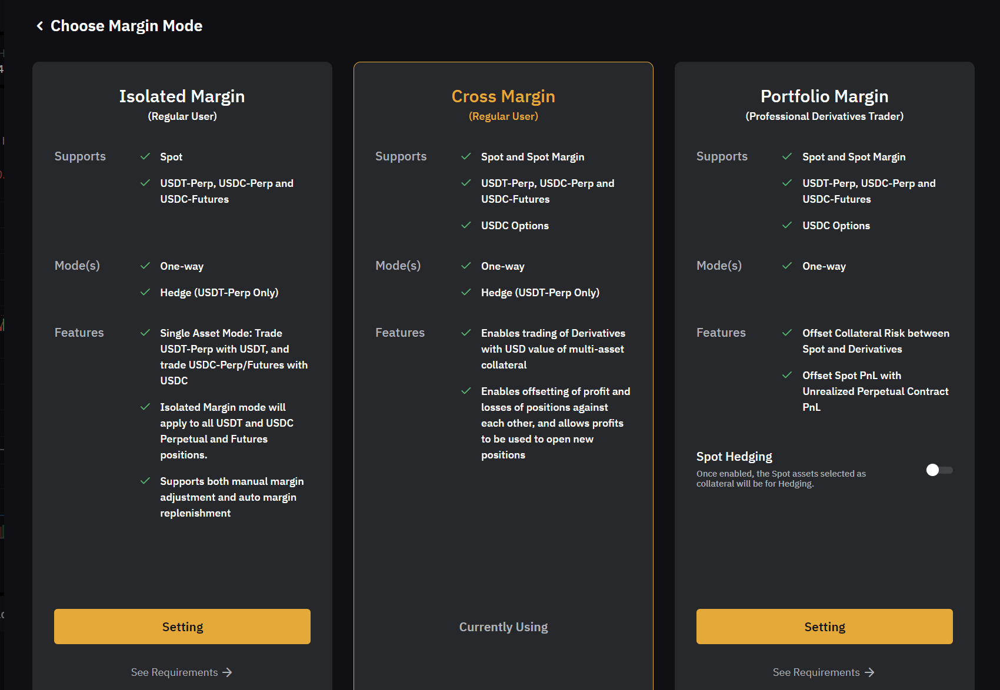<figcaption></figcaption></figure>

<figure>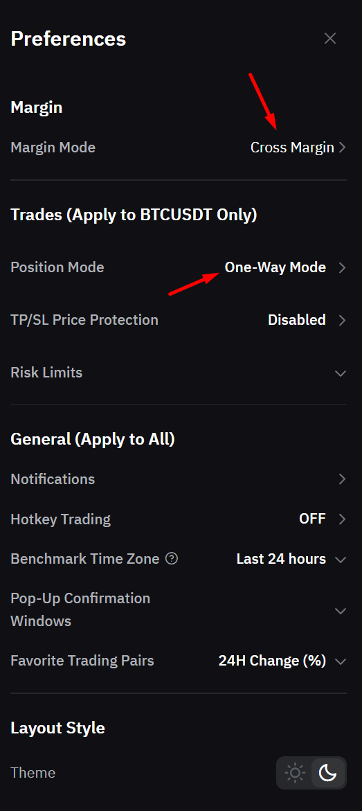<figcaption></figcaption></figure>

<figure>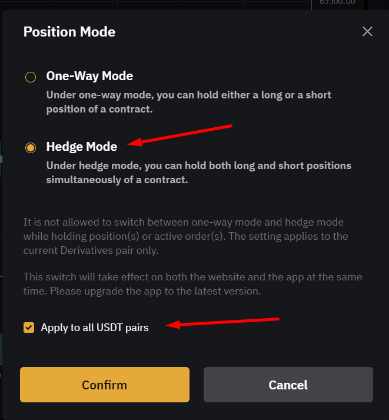<figcaption></figcaption></figure>

Please check Apply to all USDT pairs!\
\
To test everything is passed well go to Formion Portfolio Settings\
and you will see something like this for Binance\\

<figure>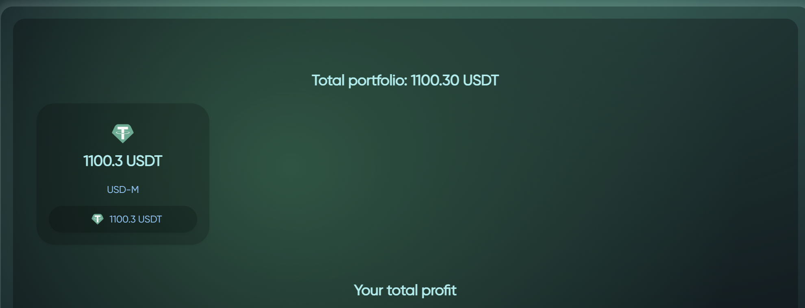<figcaption></figcaption></figure>

Or for Bybit

<figure>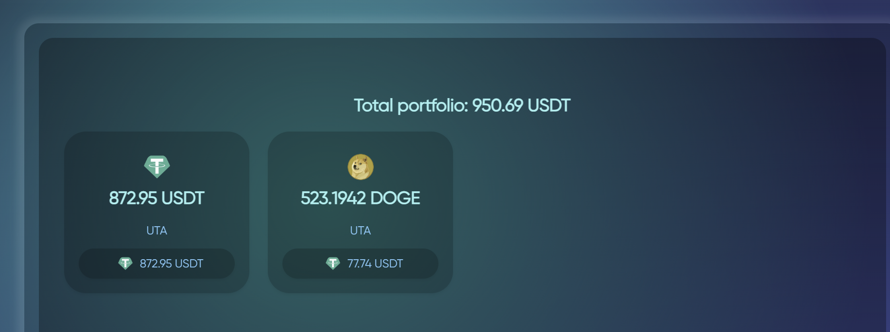<figcaption></figcaption></figure>

### If you are able to see your portfolio, congrats! You are now ready to use Formion Trading App!
