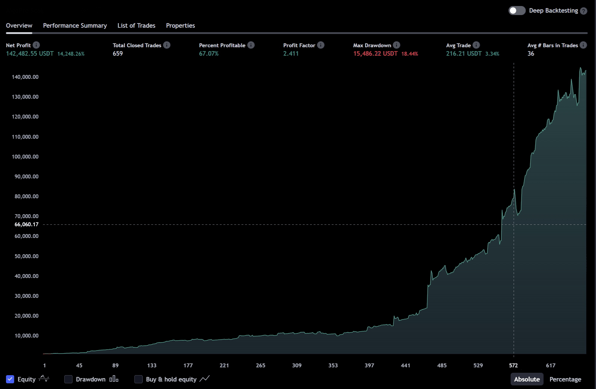
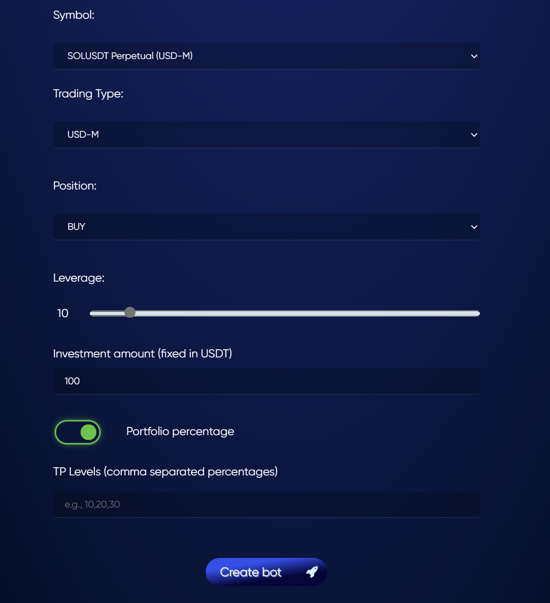

# 💹 Smart Bots

## Overview of Smart Bots 🤖

Hemera's Smart Bots implement pre-defined trading strategies based on TradingView indicators. These bots operate on various exchanges, including Binance and Bybit. They offer a simpler, rule-based approach to trading, making them suitable for traders who prefer a more hands-on strategy setup. Currently, Smart Bots operate using long/short and close long/close short commands. Development is underway to implement a DCA (Dollar-Cost Averaging) model with multiple take-profit (TP) levels instead of a single close command.

#### Difference Between Smart Bots and AI Bots 🧠

While both Smart Bots and AI Bots are designed to enhance trading efficiency, they operate in fundamentally different ways:

* **Smart Bots:** Implement pre-defined trading strategies based on user inputs and TradingView indicators. They offer a simpler, rule-based approach to trading, making them suitable for traders who prefer a more hands-on strategy setup. Smart Bots do not use AI, cannot learn, and can only have their settings adjusted by the Hemera team.
* **AI Bots:** Use advanced machine learning algorithms and real-time data analysis to make autonomous trading decisions. These bots are capable of learning, adapting to market conditions, and providing highly optimized trading strategies. AI Bots can be trained and upgraded over time.

#### Automated Trading ⚙️

Smart Bots are designed to execute trades automatically based on predefined strategies set by the Hemera Team. This allows traders to implement consistent strategies without the need for constant monitoring.

#### Indicator-Based Strategies 📊

Hemera's Smart Bots utilize TradingView indicators such as moving averages, RSI, and Bollinger Bands to make informed trading decisions. Users cannot customize the indicators or strategies, but they can rely on the Hemera team's pre-defined setups.

#### Customizable Settings 🛠️

Users can customize certain Smart Bot settings according to their preferences. The settings include options such as choosing the trading size and leverage for their trades.

#### Getting Started with Smart Bots 🚀

1. **Create an Account:** Sign up on Hemera to start using Smart Bots.
2. **Choose a License:** Select a suitable license or opt for a 7-day trial available after registration.
3. **Set Preferences:** Customize your Smart Bot settings, including selecting trading size and leverage.
4. **Start Trading:** Activate your Smart Bot and let it execute trades based on your predefined strategies.

#### Fees and Subscriptions 💳

* **Monthly Fee:** Access to Smart Bots is available with at least a Premium license.
* **Cancellation:** Subscriptions can be canceled at any time with no long-term commitments.

#### FAQ ❓

* **What indicators are used?** Hemera Smart Bots use TradingView indicators such as moving averages, RSI, and Bollinger Bands to make trading decisions.
* **Can I customize my trading strategy?** Users can customize certain Smart Bot settings, including selecting trading size and leverage.
* **How do I access real-time data?** Real-time data and analytics are available directly on the Hemera platform through your account dashboard.
* **Is automated trading available?** Yes, Smart Bots are designed to execute trades automatically based on predefined strategies set by the Hemera Team.
* **What risk management tools are provided?** Hemera Smart Bots offer risk management features, including stop-loss (SL) and take-profit (TP) levels, to protect your investments.
* **How do Smart Bots differ from AI Bots?** Smart Bots rely on pre-defined strategies and TradingView indicators for a rule-based approach, while AI Bots use machine learning and adaptive algorithms to make autonomous trading decisions.

For additional questions, refer to our [FAQ page](https://docs.hemeratrading.net/faq).

Right now we support BTC, SOL, RUNE and TRB symbols for Smart Bots on Bybit exchange only!\
\
You need to calculate your size properly  based on dragdown and risk.\
\
&#xNAN;_&#x46;or example let's assume you have 1k equity, you want to use 10x leverage, your margin should be somewhere 10-50% from your equity to be safe, so on this case it's around $10 to $50 which will make size around $100 up to $500 per symbol! If you want to use more symbols into the same account, you should use fixed size instead 'Portfolio % or cummulative profit'._\
\
_Note: If your risk tolerance is low do not use more then 10% position size, if you prefer more risk use from 20 to max 50%, do not use over 50% if you don't have enogh margin to cover potential losses._\
\
_Smart Bots are designed to work both in strong bull, strong bear market and durinng_ accumulation phase too!\

<figure><figcaption>
Solana SOL Short-term
</figcaption></figure>

<figure><figcaption>
Solana SOL Long-term
</figcaption></figure>

<figure><figcaption>
TRB Short-Term
</figcaption></figure>

<figure><figcaption>
TRB Long-Term
</figcaption></figure>

<figure><figcaption>
RUNE Short-term
</figcaption></figure>

<figure><figcaption>
Rune Long-term
</figcaption></figure>

_**If you want to use full amount as position size ( 100% Portfolio percentage ) with 1k equity your size should be around 1k. ( if leverage is x10 then margin will be near $100) This setup is consider as High Risk. We do not recommend to use anything above 50% as position size but that's depend per user risk!**_

<figure><figcaption>
How to set-up Smart Bot, last field TP levels is not important for SmartBots anymore as its automated!
</figcaption></figure>

#### Conclusion 🏁

Hemera's Smart Bots provide traders with the tools and insights needed to automate their trading strategies effectively. Whether you are new to trading or an experienced investor, our Smart Bots offer advanced features to enhance your market performance. Join Hemera today and take advantage of automated, indicator-based trading.

For more details, please visit our [Dashboard](https://hemeratrading.net/smart-bots).

